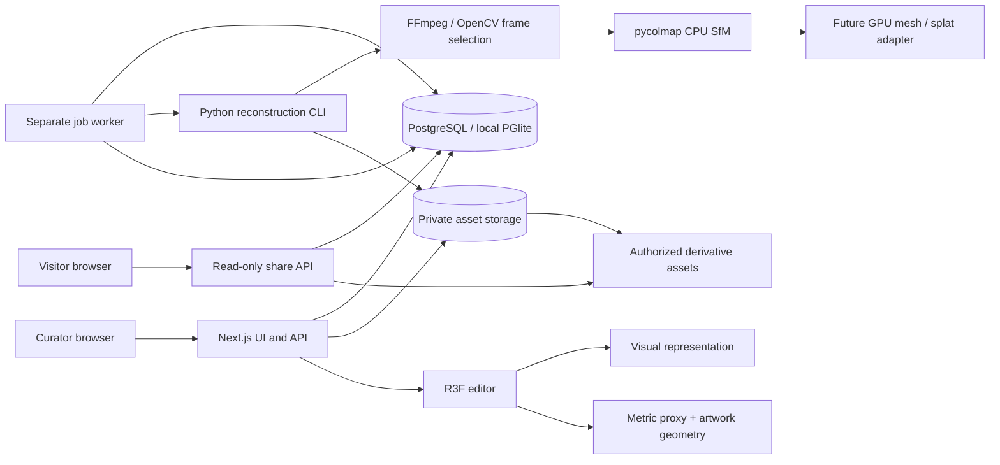

# Architecture

One web service plus one worker, with provider-neutral filesystem job manifests. GPU work is not dispatched in route handlers. The initial local database uses PostgreSQL semantics via PGlite, persisted outside public/. Runtime must serialize database access (one process owns embedded DB; worker uses internal authenticated HTTP claim/update endpoints if needed). Production PostgreSQL supports direct workers with SKIP LOCKED leases. Do not open the same PGlite data directory concurrently from two processes.

Shared contracts: packages/shared/src/index.ts; geometry helpers packages/three/src/index.ts; renderer apps/web/components/SceneCanvas.tsx; application APIs /api/galleries, /api/galleries/:id, /api/assets, /api/jobs, /api/jobs/:id, /api/exhibitions/:id, /api/shares, /api/shares/:token. Exact wire contract is INTERFACES.md.

Scene visual may be none/reference/sparse/mesh/splat; editor geometry is independent. User calibration records two points, known metric distance, prior distance and factor. Artwork dimensions are invariant under scene scale changes. Sharing freezes scene, artwork metadata, and placements; edits after share never silently change shared content.

Sources: [Next installation](https://nextjs.org/docs/app/getting-started/installation), [R3F React compatibility](https://r3f.docs.pmnd.rs/getting-started/introduction), [COLMAP tutorial](https://colmap.github.io/tutorial.html). Installed versions are pinned in package-lock.json rather than guessed from historical model knowledge.
